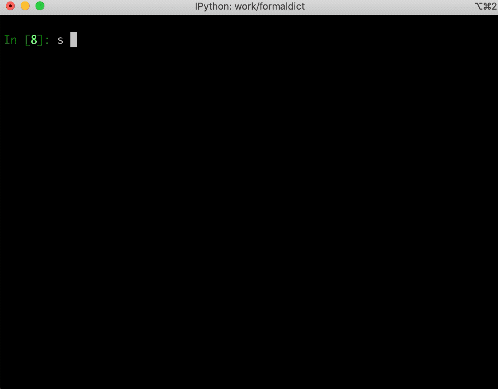
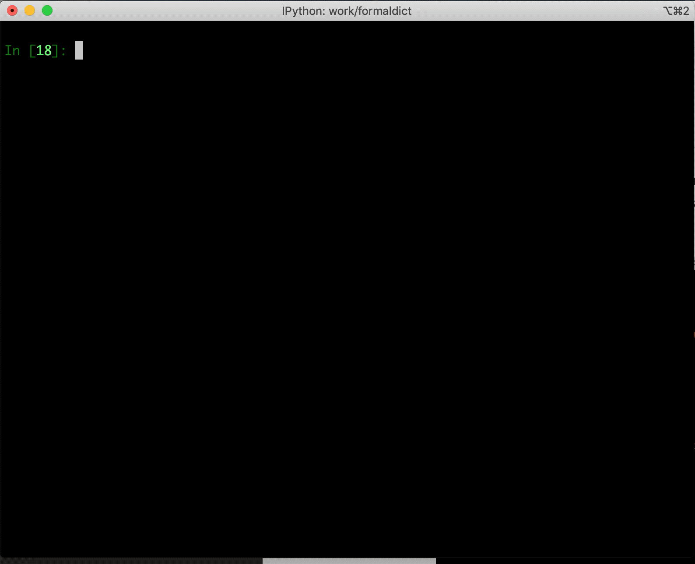
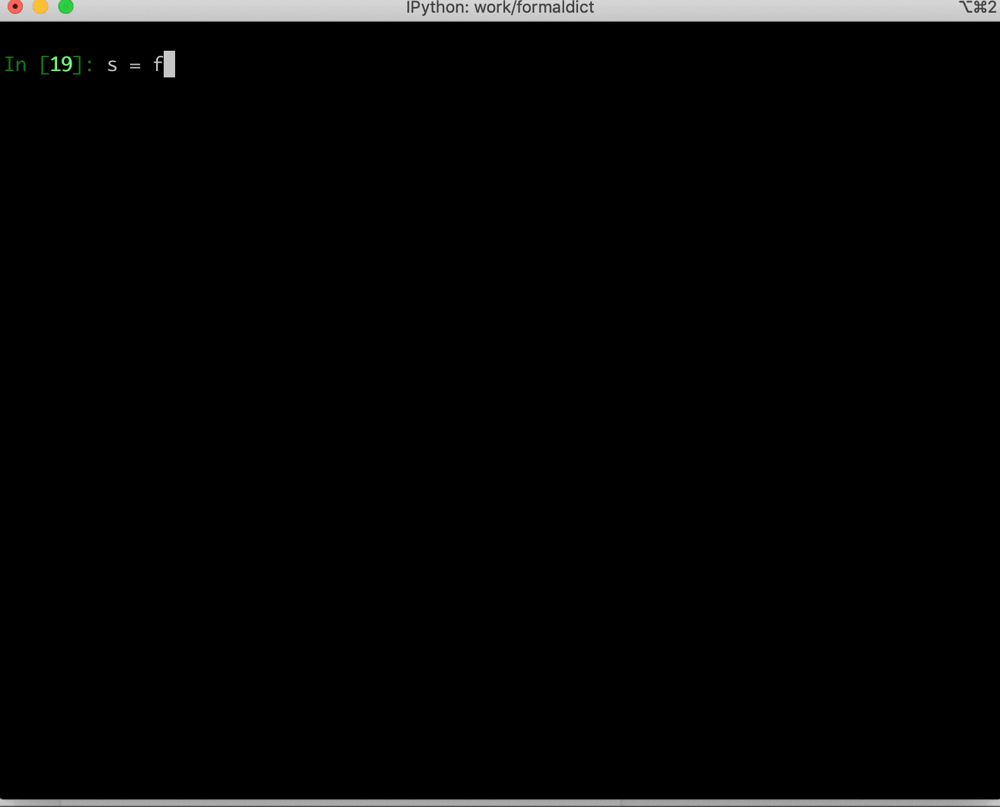

# Tutorial

The core capabilities of `formaldict` are built around the following constructs:

1. [formaldict.Schema][] - Every formal dictionary has a [Schema][formaldict.Schema] that specifies the structure. The [Schema][formaldict.Schema] allows one to [parse][formaldict.Schema.parse] a dictionary or [prompt][formaldict.Schema.prompt] for a dictionary.
2. [formaldict.FormalDict][] - The dictionary object that is returned by parsing or prompting from a [Schema][formaldict.Schema]. The [FormalDict][formaldict.FormalDict] object has all attributes in the schema or associated [formaldict.Errors][] that happened during validation.

[Schema][formaldict.Schema] objects are constructed with a serialize-able list of dictionaries that dictate the structure of the [FormalDict][formaldict.FormalDict]. We'll go over some examples of using these constructs in the following sections.

## Basic String Parsing

In the first examples, we will go over some basic examples of parsing string attributes. This schema below represents a dictionary with a `name` key:

```python
Schema([{'label': 'name'}])
```

By default, all entries in the schema are assumed to be `string` types. Along with that, all entries are required by default.

In order to parse a [FormalDict][formaldict.FormalDict] from this [Schema][formaldict.Schema], do:

```python
s = Schema([{'label': 'name'}])
d = s.parse({'name': 'my name'})
```

In the above, `d` is our [FormalDict][formaldict.FormalDict] that was parsed from the input data sent to `s.parse()`.

In this example, `d.is_valid` returns `True`, and `d['name']` returns `"my name"`.

Since all attributes are required by default, doing the following would result in an invalid [FormalDict][formaldict.FormalDict] object:

```python
s = Schema([{'label': 'name'}])
d = s.parse({'name': ''})

print (d.is_valid)
>> False
print (d.errors)
>> name: This field is required.
```

Since `name` wasn't parsed, doing `d["name"]` results in a `KeyError`.

Fields that aren't required are specified like so::

```python
Schema([{'label': 'name', 'required': False}]
```

Parsing our original example would result in a valid [FormalDict][formaldict.FormalDict] with a blank string for the `name` attribute.

Let's go into a more advanced example. In the following, we are going to make a [Schema][formaldict.Schema] to specify the name of a person, their marital status, and their zipcode:

```python
Schema([{
    'label': 'name',
}, {
    'label': 'marital_status',
    'choices': ['married', 'single', 'widowed', 'divorced'],
}, {
    'label': 'zip_code',
    'matches': '\d{5}'
}])
```

In the above, you'll see two new attributes in our [Schema][formaldict.Schema]:

1. `choices` - Limit the input to be these choices.
2. `matches` - Ensure the input matches the regex.

We only allow the marital status to be one of four choices, and the zip code is a string that must only consist of five digits.

## Prompting for Input

You might be asking yourself why schemas are specified as a list. This is because formal dictionaries can be parsed from user input using `Schema.prompt`. Attributes are collected in the order in which they are defined.

Let's use the schema example from the previous section of this tutorial and see what it's like to prompt for the schema:



## Customizing the Prompt

[Schema][formaldict.Schema] objects allow the user to customize the prompt a bit more. For example, we've extended on our previous example to change the names of attributes and the help text a user sees::

```python
Schema([{
    'label': 'name',
    'name': 'Full Name',
    'help': 'Enter your first and last name.'
}, {
    'label': 'marital_status',
    'choices': ['married', 'single', 'widowed', 'divorced'],
    'help': 'Your marital status.'
}, {
    'label': 'zip_code',
    'matches': '^\d{5}$',
    'help': 'Enter the 5-digit zip code.'
}])
```

When using the `name` key, a different name will show up next to the input. By default, the `label` is converted into a name. Any `help` will be shown at the bottom of the prompt. Below is what our prompt looks like:



## Conditional Attributes

Sometimes it is necessary to only collect attributes when previous attributes are certain values. `formaldict` provides a `condition` attribute for each entry, which allows the user to enter an express that dictates if the attribute should be entered.

Conditions in the schema are [kmatch](https://kmatch.readthedocs.io/en/latest/) patterns. The keys in the kmatch pattern must be labels from previous steps in the schema. Here's an example of our previous schema where we only collect the zip code if the user is single::

```python
Schema([{
    'label': 'name',
    'name': 'Full Name',
    'help': 'Enter your first and last name.'
}, {
    'label': 'marital_status',
    'choices': ['married', 'single', 'widowed', 'divorced'],
    'help': 'Your marital status.'
}, {
    'label': 'zip_code',
    'matches': '^\d{5}$',
    'help': 'Enter the 5-digit zip code.',
    'condition': ['==', 'marital_status', 'single']
}])
```

When the condition is true, the user will be prompted for a zip code, otherwise the attribute is not collected. Similarly, dictionary parsing will result in validations errors based on the condition. For example, say that `s` is the [Schema][formaldict.Schema] from our previous example:

```python
d = s.parse({
    'name': 'Name',
    'marital_status': 'single',
})
print(d.is_valid)
>> False
print(d.errors)
>> 'zip_code: This field is required.'
```

This error does not happen for other marital statuses:

```python
d = s.parse({
    'name': 'Name',
    'marital_status': 'married',
})
print(d.is_valid)
>> True
```

## Strict Parsing

By default, `formaldict` parsing does not encounter validation errors if parsing a dictionary that has additional keys not in the schema or not conditionally required by the schema. For example, the following data would validate our previous schema:

```python
d = s.parse({
    'name': 'Name',
    'marital_status': 'married',
    'random_key': 'random'
})
print(d.is_valid)
>> True
```

Although `random_key` will not be an attribute in the parsed [FormalDict][formaldict.FormalDict], there are no validation errors as a result of parsing it. One can use the `strict` option to catch these errors if desired::

```python
d = s.parse({
    'name': 'Name',
    'marital_status': 'married',
    'random_key': 'random'
}, strict=True)
print(d.is_valid)
>> False
print(d.errors)
>> Labels "random_key" not present in schema.
```

Similarly, since our condition for the `zip_code` attributes does not hold true, providing a zip code will also result in a similar error during strict parsing:

```python
d = s.parse({
    'name': 'Name',
    'marital_status': 'married',
    'zip_code': 'not conditionally required'
}, strict=True)
print(d.is_valid)
>> False
print(d.errors)
>> Labels "zip_code" failed conditions in schema.
```

## Additional Options

### Parsing Other Datatypes

`formaldict` currently supports `string` and `datetime` datatypes. For example::

```python
s = Schema([{
    'label': 'time',
    'type': 'datetime',
}])
d = s.parse({'time': '2019-01-01'})
print(d['time'])
>> datetime.datetime(2019, 1, 1, 0, 0)
```

Datetime entries use [python-dateutil](https://dateutil.readthedocs.io/en/stable/) for parsing, which supports a wide variety of inputs. Unix timestamps are also acceptable:

```python
d = s.parse({'time': 1579129495})
print(d['time'])
>> datetime.datetime(2020, 1, 15, 23, 4, 55)
```

### Mutli-Line Input

Prompt for multi-line input with the `multiline` attribute. For example::

```python
s = Schema([{
    'label': 'address',
    'multiline': True,
    'help': 'Enter your full address.'
}])
s.prompt()
```

The prompt will look like the following:



!!! note

    When using multi-line input, the ENTER key will start a new line. One must hit ESC followed by ENTER to submit the value.
